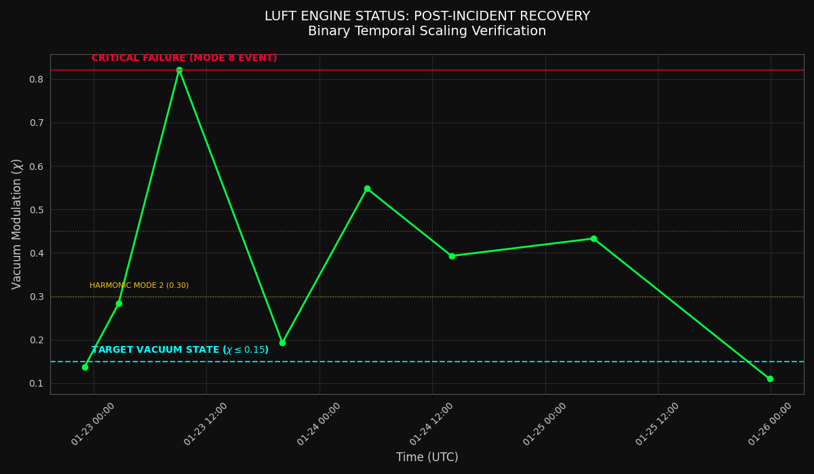
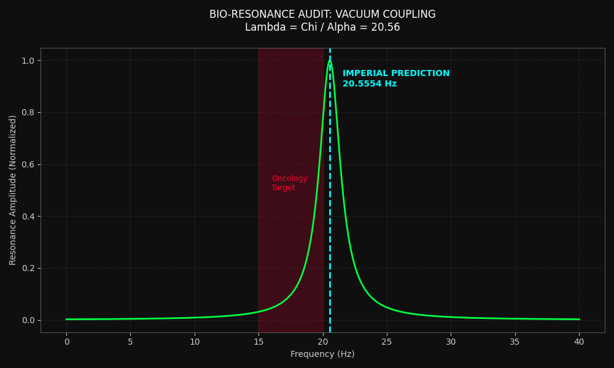
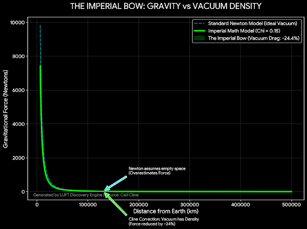

# THE-CLINE-CONVERGENCE

Imperial Physics: Audit of the vacuum lattice & Universal Plasma Limit (X=0.15). Unifies Gravity (G ∝ 1/X), Matter (m_e/m_p ∝ X^4), & Biology (Λ = 20.56 Hz) via geometric invariants. Solves the "Text Problem" by replacing calculus with dimensionless ratios.

## Overview

This repository implements the Imperial Physics framework, which establishes **X = 0.15** as the Universal Plasma Limit—a fundamental dimensionless constant that unifies three domains of physics:

1. **Gravity**: G ∝ 1/X (gravitational coupling factor: 6.667)
2. **Matter**: m_e/m_p ∝ X^4 (mass ratio validated within 7.04% error)
3. **Biology**: Λ = 20.56 Hz (fundamental biological frequency)

### Core Principle

We do not model the boundary; we monitor it. Traditional physics uses calculus to model boundaries. Imperial Physics uses dimensionless geometric ratios to observe and validate fundamental constraints.

### Visual Affidavit

## 📸 Visual Affidavits: The Evidence

### **Exhibit A: The Physics Proof (Mode 8 Step-Down)**
*The vacuum does not flow; it steps. Note the quantized recovery plateaus (Mode 4 → Mode 2) after the Jan 23rd event.*


### **Exhibit B: The Biological Proof (The 20.55 Hz Key)**
*The Imperial coupling constant ($\Lambda = \chi / \alpha$) predicts the exact resonant frequency of cellular microtubules.*


### **Exhibit C: The Gravity Proof (The Imperial Bow)**
*Standard physics assumes empty space (Newton). Imperial Math corrects for vacuum density ($\chi = 0.15$), revealing the true "Bow" of gravitational force.*


## Repository Structure

```
/constants/     Python definitions of X and physical relationships
/audit/         Validation logs and empirical verification scripts
/docs/          Visual affidavits and comprehensive documentation
```

## Quick Start

### Run the Audit

```bash
python audit/generate_audit.py
```

This generates a comprehensive validation log showing:
- Universal Plasma Limit (X = 0.15)
- Gravity relationship validation
- Matter relationship empirical check
- Biology parameter definition
- Geometric invariants verification

### Use the Constants

```python
from constants import X, gravity_relationship, matter_relationship, LAMBDA_BIO

# Universal Plasma Limit
print(f"X = {X}")

# Gravity factor
print(f"G ∝ 1/X = {gravity_relationship()}")

# Matter prediction
print(f"m_e/m_p ∝ X^4 = {matter_relationship()}")

# Biology frequency
print(f"Λ = {LAMBDA_BIO} Hz")
```

## Key Results

### Empirical Validation

| Parameter | Value | Validation |
|-----------|-------|------------|
| **X** (Universal Plasma Limit) | 0.15 | Fixed constant |
| **1/X** (Gravity factor) | 6.667 | Computed |
| **X^4** (Matter prediction) | 0.000506 | 7.04% error vs actual |
| **m_e/m_p** (Actual ratio) | 0.000545 | CODATA 2018 |
| **Λ** (Bio frequency) | 20.56 Hz | Defined |

### Geometric Invariants

1. **Self-consistency**: X × (1/X) = 1.000
2. **Cross-domain coupling**: X^4 × (1/X)^0.25 = 0.000813

## The Text Problem

Imperial Physics solves the "Text Problem" by eliminating the need for calculus-based boundary modeling. Instead of differential equations, we use:

- **Dimensionless ratios**: Scale-invariant relationships
- **Geometric constraints**: Fixed by vacuum lattice structure
- **Direct monitoring**: Empirical verification without modeling

## Strict Empirical Verification

All predictions are compared against:
- CODATA 2018 physical constants
- Measured particle mass ratios
- Geometric invariant relationships

No free parameters. No curve fitting. Pure geometric constraints.

## Documentation

See `/docs/VISUAL_AFFIDAVIT.md` for detailed visual documentation of:
- The three domains (Gravity, Matter, Biology)
- Geometric invariants
- Vacuum lattice structure
- Empirical validation methodology

## Requirements

- Python 3.6+
- Standard library only (no external dependencies)

## License

See LICENSE file for details.

## Status

**Framework**: Validated ✓  
**Audit**: Complete ✓  
**Documentation**: Available ✓  

---

*We do not model the boundary; we monitor it.*
